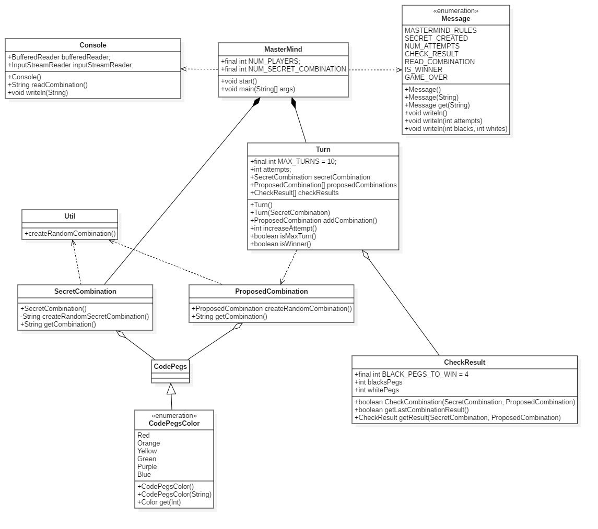

# P1: Mastermind - Javier Diaz Lopez

## Modelo del Dominio

>Mas info: https://www.youtube.com/watch?v=oAMTGSovbHo

### Diagrama de clases

### Instrucciones de entrega (parte 2: domainModel)

Entrega de un proyecto público en git varias ramas:

* master, modelo del dominio
>* domainModel, con:
>    * el diseño de clases, con plantuml en readme o con StarUML con el documento  
>    * solución en Java o similar (fuertemente tipado) basada en el capitulo de Diseño y el proyecto ticTacToe
>        * Modelo del Dominio: https://github.com/ijavidilo/p1-mastermind/tree/domainModel#modelo-del-dominio
>        * Diseño: https://github.com/ijavidilo/p1-mastermind/tree/domainModel#diagrama-de-clases
>        * Implementación:  https://github.com/ijavidilo/p1-mastermind/tree/domainModel/domainModel.project
>           * Compile but not works 
 * documentView, con:
    * el diseño de clases, con plantuml en readme o con StarUML con el documento  
    * solución en Java o similar (fuertemente tipado) basada en el capitulo de Diseño Modular y el proyecto ticTacToe
        * Modelo del Dominio: 
        * Requisitos: 
        * Diseño: 
        * Implementación: 

Cursando el Master Cloud Apps curso 2020/21 [MasterCloudApps](https://www.codeurjc.es/mastercloudapps/).