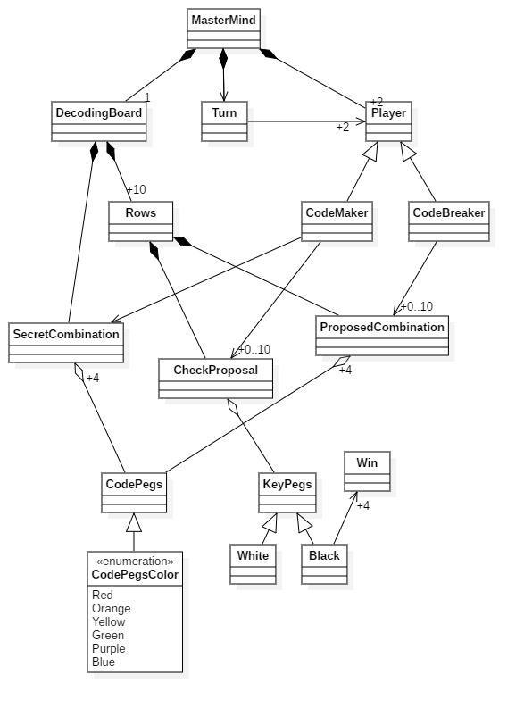

# P1: Mastermind - Javier Diaz Lopez (parte 1: master)

  * ## Anotaciones alumno: 
  > Se ha creado y adjuntado el modelo del dominio con el nombre domain-model.jpg asi como el fichero StartUML de dicho modelo.

## Modelo del Dominio

>Mas info: https://www.youtube.com/watch?v=oAMTGSovbHo

### Diagrama

### Instrucciones de entrega

Entrega de un proyecto público en git varias ramas:

* **master**, modelo del dominio
* **domainModel**, con:
    * el diseño de clases, con plantuml en readme o con StarUML con el documento  
    * solución en Java o similar (fuertemente tipado) basada en el capitulo de Diseño y el proyecto ticTacToe
        * Modelo del Dominio: https://github.com/ijavidilo/p1-mastermind/tree/domainModel#modelo-del-dominio
        * Requisitos: https://github.com/ijavidilo/p1-mastermind/tree/master/Requisitos
        * Diseño: https://github.com/ijavidilo/p1-mastermind/tree/domainModel#diagrama-de-clases
        * Implementación:  https://github.com/ijavidilo/p1-mastermind/tree/domainModel/domainModel.project
 * **documentView**, con:
    * el diseño de clases, con plantuml en readme o con StarUML con el documento  
    * solución en Java o similar (fuertemente tipado) basada en el capitulo de Diseño Modular y el proyecto ticTacToe
        * Modelo del Dominio: https://github.com/ijavidilo/p1-mastermind/tree/documentView#modelo-del-dominio
        * Requisitos:  https://github.com/ijavidilo/p1-mastermind/tree/master/Requisitos
        * Diseño: https://github.com/ijavidilo/p1-mastermind/tree/documentView#diagrama-documentview
        * Implementación: He copiado y entendido directamente el codigo del profesor
* **modelViewPresenter**, con:
    * el diseño de clases, con plantuml en readme o con StarUML con el documento  
    * solución en Java o similar (fuertemente tipado) basada en el capitulo de Diseño Orientado a Objetos y el proyecto ticTacToe desde la rama dv.withoutFactoryMethod hasta mvp.pm.withDoubleDispatching
        * Modelo del Dominio: https://github.com/ijavidilo/p1-mastermind/tree/modelViewPresenter#modelo-del-dominio
        * Requisitos:  https://github.com/ijavidilo/p1-mastermind/tree/master/Requisitos
        * Diseño: https://github.com/ijavidilo/p1-mastermind/tree/modelViewPresenter#diagrama-documentview
        * Implementación:

Master Cloud Apps curso 2020/21 [MasterCloudApps](https://www.codeurjc.es/mastercloudapps/).