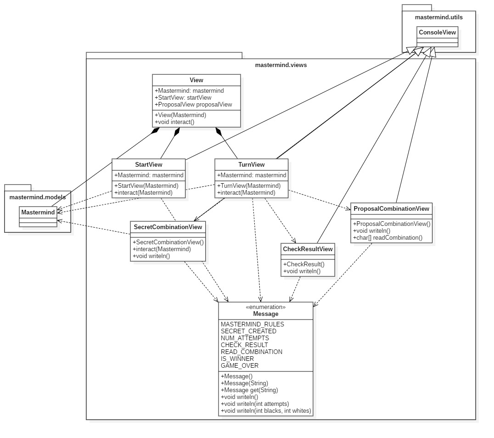
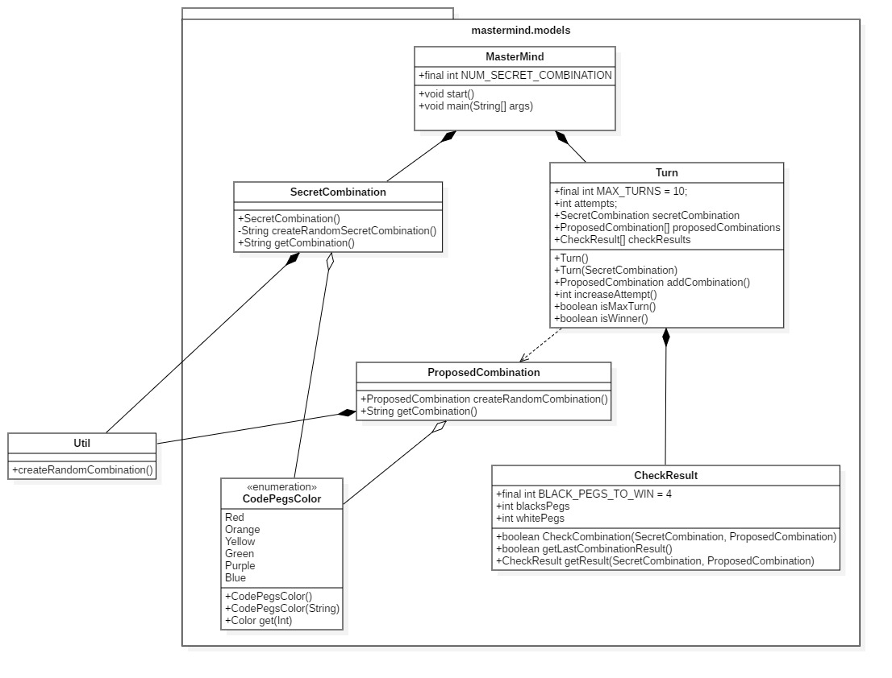

# P1: Mastermind - Javier Diaz Lopez (parte 3: documentView)

  * ## Anotaciones alumno: 
  > Evaluar la parte del modelo y vistas del diagrama "DocumentView" realizado a partir de mi propia solución. Con respecto a la implementación, he cogido el código proporcionado por el profesor y entendido todas sus partes pero no me ha dado tiempo a implementar mi solución.

## Modelo del Dominio

>Mas info: https://www.youtube.com/watch?v=oAMTGSovbHo

### Diagrama DocumentView
#### - Paquete mastermind.views

#### - Paquete mastermind.models

### Instrucciones de entrega (parte 3: documentView)

Entrega de un proyecto público en git varias ramas:

* master, modelo del dominio
* domainModel, con:
    * el diseño de clases, con plantuml en readme o con StarUML con el documento  
    * solución en Java o similar (fuertemente tipado) basada en el capitulo de Diseño y el proyecto ticTacToe
        * Modelo del Dominio: https://github.com/ijavidilo/p1-mastermind/tree/domainModel#modelo-del-dominio
        * Requisitos: https://github.com/ijavidilo/p1-mastermind/tree/master/Requisitos
        * Diseño: https://github.com/ijavidilo/p1-mastermind/tree/domainModel#diagrama-de-clases
        * Implementación:  https://github.com/ijavidilo/p1-mastermind/tree/domainModel/domainModel.project
> * documentView, con:
>    * el diseño de clases, con plantuml en readme o con StarUML con el documento  
>    * solución en Java o similar (fuertemente tipado) basada en el capitulo de Diseño Modular y el proyecto ticTacToe
>        * Modelo del Dominio: https://github.com/ijavidilo/p1-mastermind/tree/documentView#modelo-del-dominio
>        * Requisitos:  https://github.com/ijavidilo/p1-mastermind/tree/master/Requisitos
>        * Diseño: https://github.com/ijavidilo/p1-mastermind/tree/documentView#diagrama-documentview
>        * Implementación: He copiado y entendido directamente el codigo del profesor

Cursando el Master Cloud Apps curso 2020/21 [MasterCloudApps](https://www.codeurjc.es/mastercloudapps/).